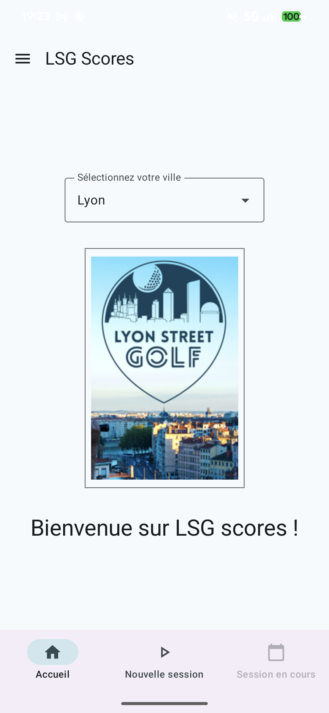
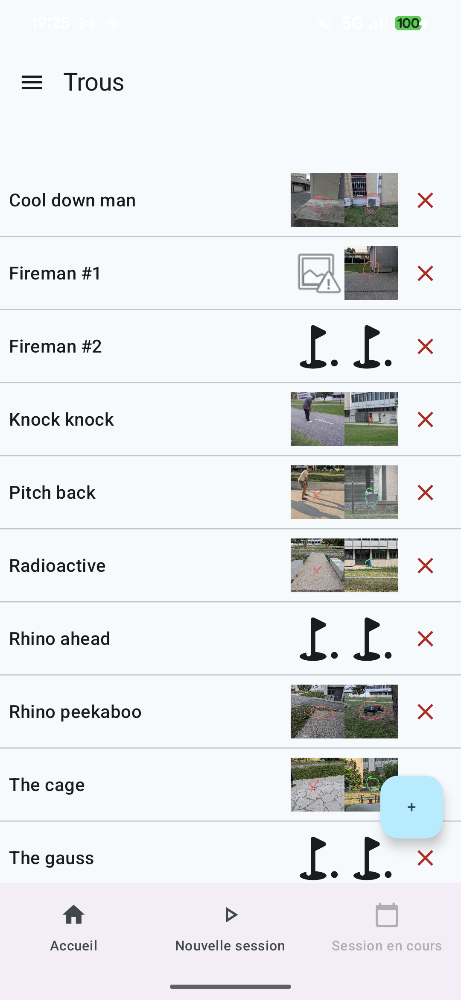
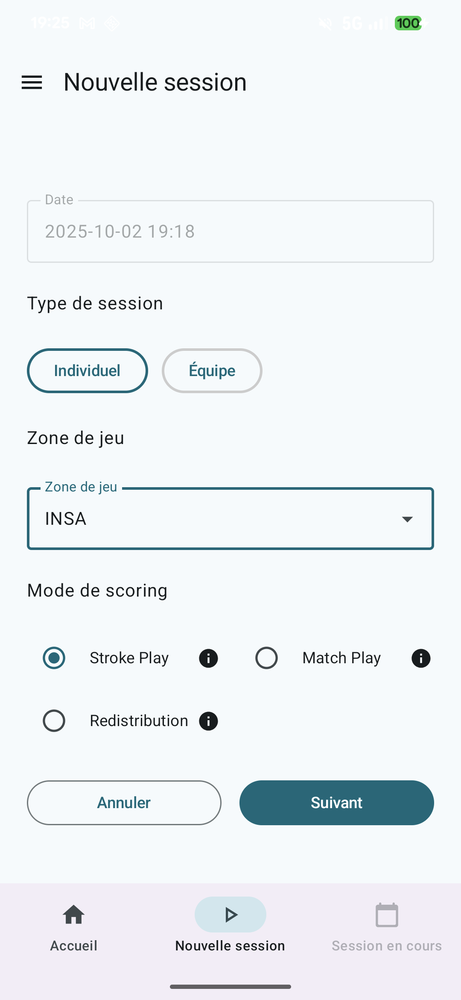
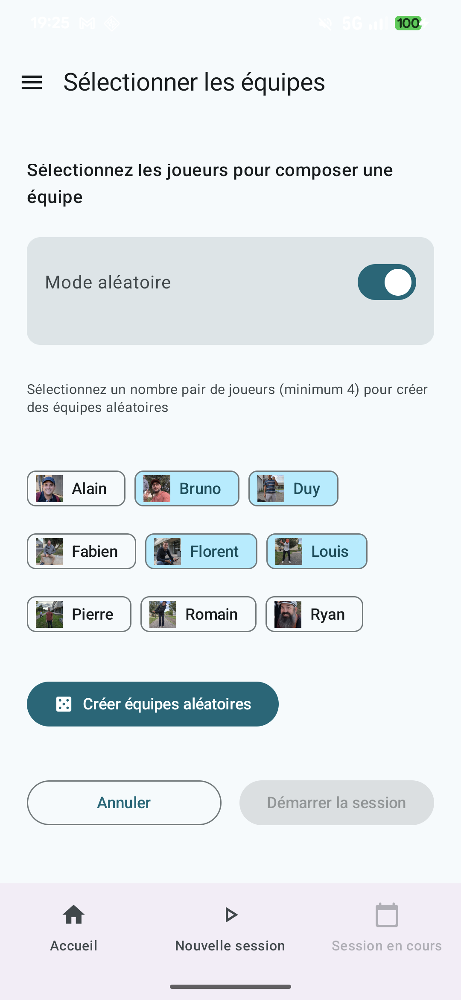
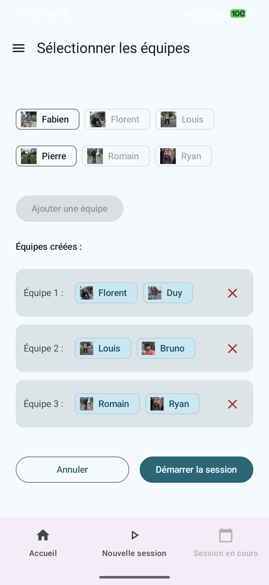
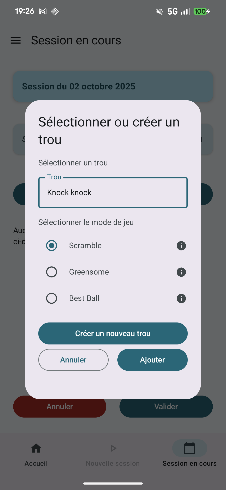
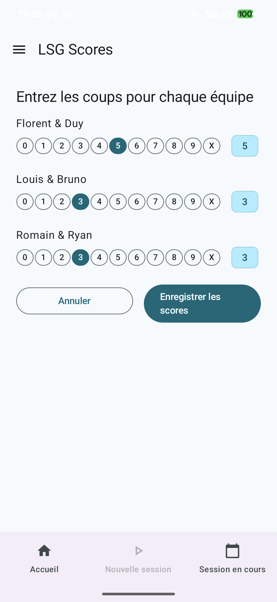
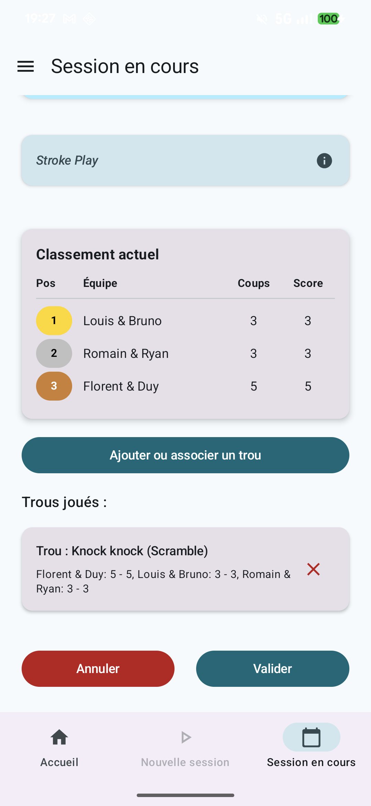
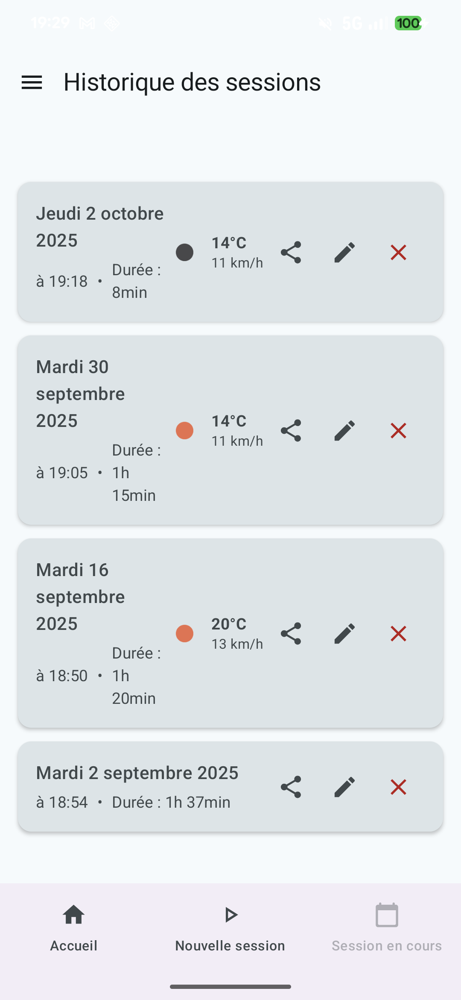

# LsgScores

Application Android (Kotlin/Jetpack Compose) pour gérer et suivre des scores de parties sur des parcours à trous (golf, disc golf, mini‑golf, etc.). Le projet inclut la gestion des joueurs, des zones de jeu, des trous et des sessions, avec un système de scoring, une intégration météo et un backend (Supabase) pour la persistance distante.

## Sommaire
- Aperçu
- Fonctionnalités
- Architecture et technologies
- Prérequis
- Démarrage rapide
- Configuration (clés/API)
- Lancer les tests
- Structure du projet
- Captures d’écran
- Contribution
- Licence

## Aperçu
LsgScores permet de créer des sessions de jeu, d’ajouter des joueurs, de saisir les scores trou par trou et de consulter l’historique. L’application s’appuie sur Jetpack Compose pour l’UI et s’intègre à des services externes (météo, Supabase) pour enrichir l’expérience.

## Fonctionnalités
- Gestion des joueurs et de leurs détails
- Création et suivi de sessions (parties) et d’historiques
- Saisie des scores par trou, avec différents modes de score
- Gestion des zones de jeu et des parcours
- Intégration météo (consultation des conditions)
- Persistance locale et/ou distante (Room/Supabase)
- Interface moderne en Jetpack Compose

## Architecture et technologies
- Langage: Kotlin
- UI: Jetpack Compose
- DI: Hilt (ou autre, selon implémentation)
- Persistance locale: Room (AppDatabase)
- Backend: Supabase (DAO dédié)
- Réseau / Sérialisation: Kotlinx Serialization (selon modules)
- Tests: JUnit (tests unitaires sous `app/src/test`)

## Prérequis
- Android Studio (version récente, Giraffe/Koala ou supérieure)
- JDK compatible avec la version Gradle/AGP du projet
- SDK Android correctement installé
- Accès aux clés/API (Supabase, météo) le cas échéant

## Démarrage rapide
1. Cloner le dépôt
   ```bash
   git clone <URL_DU_DEPOT>
   cd LsgScores
   ```
2. Ouvrir le projet dans Android Studio et attendre l’indexation/synchronisation Gradle.
3. Lancer l’application:
   - Depuis Android Studio: bouton « Run » sur un émulateur ou un appareil connecté.
   - En ligne de commande:
     ```bash
     ./gradlew assembleDebug    # macOS/Linux
     .\gradlew.bat assembleDebug # Windows
     ```

## Configuration (clés/API)
Certaines fonctionnalités (Supabase, météo) nécessitent des clés ou URLs. Vous pouvez les fournir via l’un des mécanismes suivants, selon votre préférence actuelle dans le projet:
- `local.properties` (non versionné) pour du développement local
- `gradle.properties` (utiliser la variante locale non versionnée si possible)

Exemple de variables (à adapter au projet réel):
```
SUPABASE_URL=https://votre‑instance.supabase.co
SUPABASE_ANON_KEY=xxxxxxxxxxxxxxxxxxxxxxxxxxxxxxxx
WEATHER_API_KEY=xxxxxxxxxxxxxxxxxxxxxxxxxxxxxxxx
```
Important: ne commitez jamais de secrets dans le dépôt. Préférez des placeholders et la documentation.

## Lancer les tests
```bash
./gradlew test            # macOS/Linux
.\gradlew.bat test       # Windows
```
Les tests unitaires se trouvent dans `app/src/test/java/...`.

## Structure du projet
- `app/src/main/java/fr/centuryspine/lsgscores` — Code source principal
  - `data/` — Accès aux données (Room, Supabase, repositories, sérialisation, météo, etc.)
  - `domain/` — Logique métier (ex: scoring)
  - `ui/` — Écrans Compose (players, sessions, holes, home, settings…)
  - `viewmodel/` — ViewModels
  - `di/` — Injection de dépendances
  - `utils/` — Utilitaires
- `app/src/main/res/` — Ressources Android (valeurs, drawables, mipmaps, xml)
- `supabase/` — Scripts/SQL liés au backend Supabase
- Fichiers Gradle: `build.gradle.kts`, `settings.gradle.kts`, `gradle.properties`

## Captures d’écran
Les captures d’écran ci-dessous sont disponibles dans `app/src/doc`.

<p align="center">
  
  
  
  <br/>
  
  
  
  <br/>
  
  
  
</p>

## Contribution
Les contributions sont les bienvenues!
- Ouvrez une issue pour discuter d’une idée ou d’un bug
- Proposez une PR avec des changements ciblés et testés
- Respectez le style de code Kotlin/Compose et ajoutez des commentaires au besoin

## Licence
Aucune licence explicite n’est fournie pour l’instant. Ajoutez un fichier `LICENSE` si vous souhaitez publier sous une licence (MIT, Apache‑2.0, etc.).

---

Questions, retours ou demandes spécifiques (FR/EN, badges, CI, screenshots)? N’hésitez pas à ouvrir une issue ou à proposer une PR.

## Politique de confidentialité (Play Store)
- Modèle inclus: app/src/doc/privacy-policy-fr.html
- Référence Google Play: https://support.google.com/googleplay/android-developer/answer/9859455?hl=fr#privacy_policy

Comment personnaliser le modèle
1) Ouvrez app/src/doc/privacy-policy-fr.html et remplacez les champs entre crochets par vos informations (éditeur, adresse, e‑mail, services tiers réellement utilisés).
2) Mettez à jour la date « Dernière mise à jour ».
3) Retirez les services non utilisés (ex. Crashlytics/Analytics) ou précisez leur usage.

Héberger la politique sur Supabase Storage (URL publique)
1) Dans Supabase, créez un bucket public (ex.: PublicDocs, legal ou policies).
2) Uploadez le fichier privacy-policy-fr.html dans ce bucket.
3) Très important: définissez les métadonnées Content-Type de l’objet à text/html pour éviter un affichage en texte brut dans le navigateur.
   - UI Supabase: Storage > votre bucket > objet > Details > Metadata > Content-Type = text/html
   - CLI/API: envoyez l’en-tête Content-Type: text/html à l’upload
4) Rendez l’objet public (si le bucket n’est pas déjà public).
5) L’URL publique aura la forme:
   https://YOUR-PROJECT.supabase.co/storage/v1/object/public/BUCKET_NAME/privacy-policy-fr.html
   Remplacez YOUR-PROJECT et BUCKET_NAME par vos valeurs.
6) Vérifiez l’accessibilité anonyme de l’URL (dans une fenêtre privée).

Déclarer l’URL dans la Play Console
- App content > Privacy policy: collez l’URL publique du fichier hébergé sur Supabase.
- Section Sécurité des données: déclarez les catégories de données collectées/partagées et les finalités, en cohérence avec la politique.

Intégration (facultative) dans l’app
- Ajoutez un lien « Politique de confidentialité » dans l’écran Paramètres/A propos et ouvrez l’URL publique avec un Intent ACTION_VIEW.

Bonnes pratiques
- Versionnez le fichier modèle dans le dépôt, mais n’y mettez pas d’informations confidentielles.
- A chaque changement matériel (nouvelle collecte/finalité), mettez à jour le fichier et la date, et redéployez sur le même objet du bucket pour conserver l’URL.
- Si vous ciblez l’UE/FR, vérifiez la conformité RGPD (droits, bases légales, transferts) et complétez si nécessaire (registre de traitements, DPA avec prestataires, etc.).
